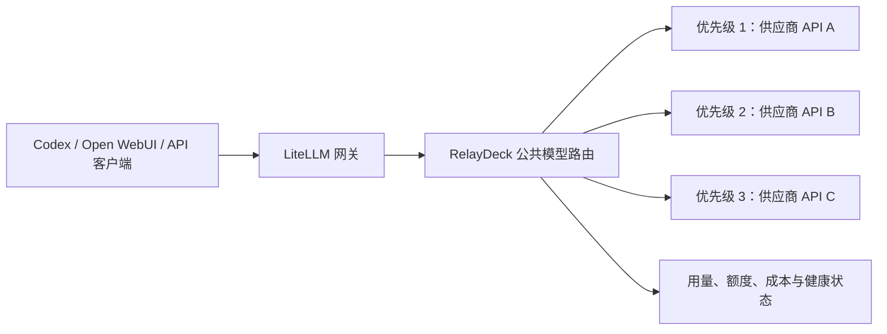
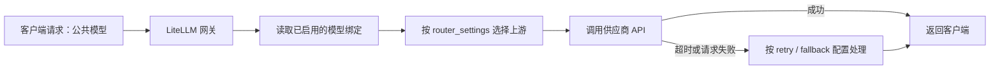
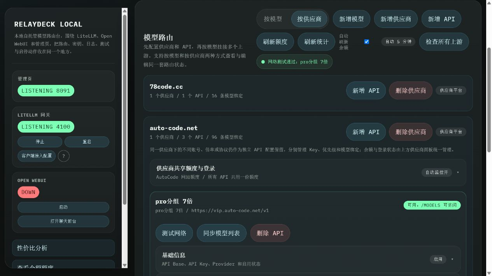
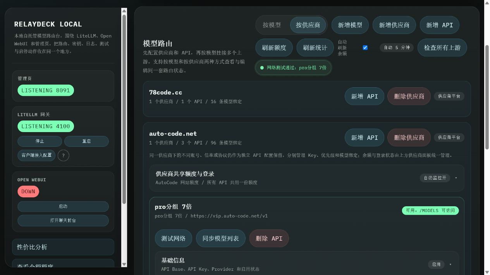
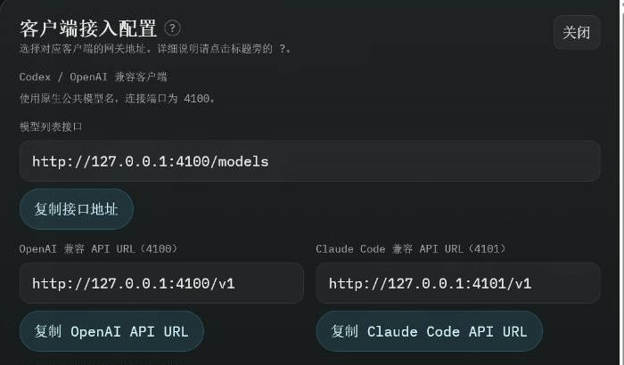
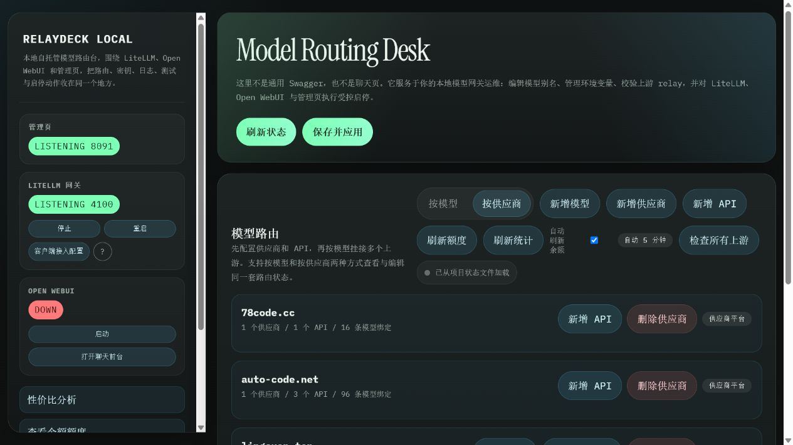
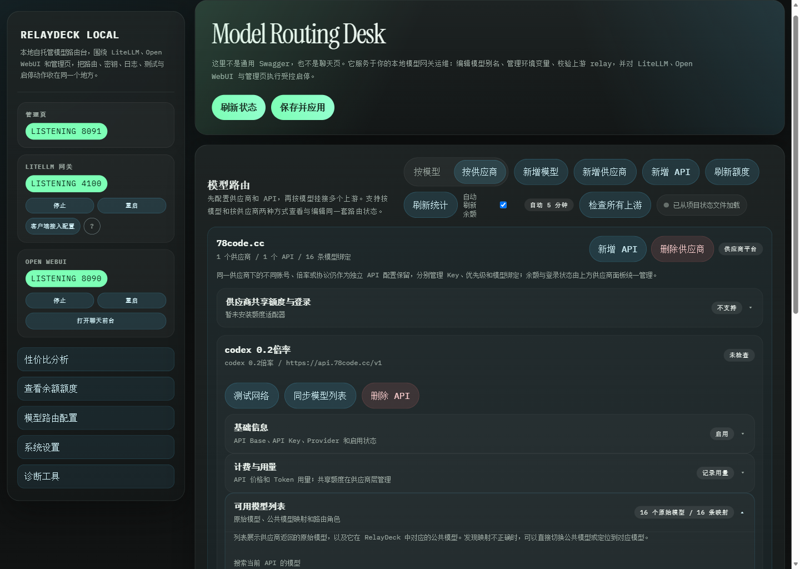
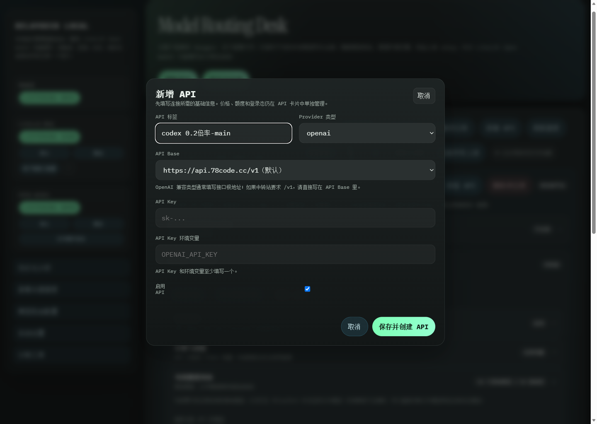

# RelayDeck Local

一个面向 Windows 本地环境的多供应商 LLM 网关与管理台。RelayDeck 将
LiteLLM、Open WebUI 和供应商管理集中到同一套工作流中：客户端只需要连接
一个稳定地址，系统负责按模型、优先级、健康状态、额度和成本选择上游，并在
失败时自动切换。

## 功能概览

- **统一模型入口**：为 Codex、Open WebUI 和其他 OpenAI 兼容客户端提供统一
  的本地网关地址。
- **公共模型路由**：把多个供应商的原始模型映射为稳定的公共模型名称。
- **故障转移**：按绑定优先级在已启用的上游之间自动切换。
- **供应商管理**：按供应商和 API 分组维护 API Base、密钥、原始模型与启用状态。
- **健康检查与测试**：区分低成本的网络检查与实际对话测试。
- **额度、用量与成本**：记录请求用量、配置价格，并展示供应商与模型的成本对比。
- **额度适配器**：可为非标准供应商 API 扩展余额和额度采集。
- **Claude Code 网关**：为 Claude Code 提供独立的 Anthropic 兼容入口与模型发现。

## 核心调度能力：多供应商 API 与优先级路由

RelayDeck 将多个供应商的 API 统一纳入管理台：每个供应商可以维护多个 API 分组，
分别配置 API Base、Provider 类型、密钥或密钥环境变量、启用状态和已同步模型。密钥
仅保留在本地受管配置中，客户端无需保存每个供应商的凭据。

一个公共模型可以绑定多个来自不同供应商或不同 API 分组的上游模型。每个绑定都有
明确的优先级，数字越小越靠前；它决定管理台中的排序、拖拽重排结果与生成配置的
顺序。客户端始终使用同一个公共模型名称，不需要手动改写模型名或切换供应商。

```text
公共模型：gpt-5.4
  优先级 1 -> 供应商 A / API 分组 A1 / 上游模型 gpt-5.4
  优先级 2 -> 供应商 B / API 分组 B1 / 上游模型 gpt-5.4
  优先级 3 -> 供应商 C / API 分组 C2 / 上游模型 gpt-5.4-mini
```

通过这一层映射，可以在不影响 Codex、Open WebUI 或其他客户端配置的前提下，集中
调整供应商、API 分组、优先级和路由配置。



## 路由决策规则与故障转移边界

请求先以公共模型名称进入 LiteLLM 网关，再由 RelayDeck 生成的模型绑定与
`router_settings` 参与选择。优先级是可维护的配置顺序，但并不单独等同于运行时的
强制主备切换策略。



当前默认生成配置使用 `routing_strategy: simple-shuffle`、`num_retries: 2`、
`timeout: 60`，且 `fallbacks` 默认为空。这意味着：

- **优先级**：管理台按数字从小到大展示和生成绑定；它适用于规划与配置审查，但默认
  `simple-shuffle` 不承诺每个请求都先命中最低数字的绑定。
- **健康状态**：网络检查与对话测试会显示在管理台，供操作人员决定是否禁用或调整
  上游；默认配置不会把检查结果自动当作熔断器。
- **额度、成本与延迟**：系统记录和展示这些信息，用于运营判断与手动调度；默认不会
  依据它们自动重排流量。
- **失败处理**：网关按当前重试与回退配置处理超时和上游请求失败。要实现确定的主备
  切换，需在发布前配置相应的路由策略与 `fallbacks`，并对目标模型执行实际对话测试。
- **客户端感知**：客户端使用同一公共模型名；成功回退时无需改变客户端配置。未配置
  可用回退时，最终错误会直接返回给客户端。



管理台在供应商 API 层保留模型绑定和路由角色（主路由、第一备用、第二备用等），便于
在应用配置前核对实际的映射顺序。默认 `simple-shuffle` 策略仍以 `router_settings`
为准，上图用于展示可审计的配置与状态，而不是声称已启用强制主备切换。



“测试网络”只验证上游连通性和模型发现接口，不发起模型对话。测试完成后，页面会在
API 卡片与顶部反馈中显示通过或失败原因，作为是否调整、禁用或进一步测试该上游的依据。

## 兼容性矩阵

| 客户端 | 接入地址或方式 | 协议与模型发现 | 使用要点 |
| --- | --- | --- | --- |
| Codex | `http://127.0.0.1:4100/v1` | OpenAI 兼容；使用已发布公共模型 | 保持一个稳定 Base URL，通过公共模型名访问上游。 |
| Open WebUI | `http://127.0.0.1:4100/v1` | OpenAI 兼容；读取网关公开模型 | 在 Open WebUI 中配置本地网关密钥与 Base URL。 |
| 其他 OpenAI 兼容客户端 | `http://127.0.0.1:4100/v1` | OpenAI 兼容 | 使用 `chat/completions` 与模型列表等兼容接口。 |
| Claude Code | 管理台的 Claude Code 配置入口，网关端口 `4101` | Anthropic 兼容；模型别名为 `claude-relaydeck-*` | 应用配置后完全退出并重新启动 Claude Code，再通过 `/model` 选择模型。 |



截图仅展示可公开的本地地址；API Key 位于同一配置窗口的下方，但没有纳入文档图片。

## 可观测性与运维

管理台把网关、Open WebUI 和管理服务的运行状态放在同一页面，并提供模型路由、
供应商/API 分组、网络与对话测试、额度刷新、价格与用量、成本归因、诊断工具和日志
入口。它帮助操作人员判断某个上游是否应继续启用，而不是静默替用户做不可见的路由
决策。



上述运行面板与网络测试反馈结合，可以分别查看服务可用性、供应商/API 分组规模、
模型绑定数量，以及单个上游的可达性和模型发现结果。

### 路由配置与状态检查

在“按供应商”视图中，可展开 API 分组，查看已同步的原始模型、公共模型映射、网络
与对话状态，并维护绑定优先级。优先级数值越小越靠前，拖拽排序会同步更新数值。



### 多供应商 API 管理与凭据边界

新增 API 时，管理台将标签、Provider 类型、API Base、密钥或密钥环境变量集中在受控
表单中。一个供应商可维护多个 API 分组；密钥保存在本地受管配置，不写入客户端配置
或仓库文件。



## 服务地址

默认端口定义在 `.env.example`，可在本地 `.env` 中修改。

| 服务 | 默认地址 | 用途 |
| --- | --- | --- |
| LiteLLM 网关 | `http://127.0.0.1:4100` | OpenAI 兼容模型入口 |
| Claude Code 网关 | `http://127.0.0.1:4101` | Claude Code 专用入口 |
| Open WebUI | `http://127.0.0.1:8090` | 聊天前台 |
| RelayDeck 管理台 | `http://127.0.0.1:8091` | 供应商、模型、额度与诊断管理 |

## 前置条件

- Windows PowerShell
- Conda
- Python 3.11（建议）
- 已安装或可安装 LiteLLM 与 Open WebUI 的 Conda 环境

启动脚本默认查找名为 `llm-stack-local` 的 Conda 环境。若环境位置或名称不同，
请调整 `scripts/common.ps1` 中的环境路径解析逻辑。

## 快速开始

1. 创建并激活环境，安装依赖：

   ```powershell
   conda create -n llm-stack-local python=3.11
   conda activate llm-stack-local
   pip install -r requirements.txt
   ```

2. 创建本地环境文件：

   ```powershell
   Copy-Item .env.example .env
   ```

3. 编辑 `.env`，至少替换 `LITELLM_MASTER_KEY`、
   `OPEN_WEBUI_SECRET_KEY` 和所需供应商的 API Key。不要提交 `.env`。

4. 启动全部服务：

   ```powershell
   powershell -NoProfile -ExecutionPolicy Bypass -File .\scripts\start-all.ps1
   ```

5. 打开 `http://127.0.0.1:8091`，依次创建供应商、API 分组、公共模型和
   上游模型绑定，然后执行网络检查或对话测试。

如需单独启动服务：

```powershell
powershell -NoProfile -ExecutionPolicy Bypass -File .\scripts\start-litellm.ps1
powershell -NoProfile -ExecutionPolicy Bypass -File .\scripts\start-open-webui.ps1
powershell -NoProfile -ExecutionPolicy Bypass -File .\scripts\start-admin-panel.ps1
```

停止全部服务：

```powershell
powershell -NoProfile -ExecutionPolicy Bypass -File .\scripts\stop-llm-stack.ps1
```

## 客户端接入

将 OpenAI 兼容客户端连接到本地 LiteLLM 网关：

```text
Base URL: http://127.0.0.1:4100/v1
API Key:  <LITELLM_MASTER_KEY>
Model:    管理台中已发布的公共模型名称
```

例如客户端使用 `gpt-5.4` 时，只需将该名称作为公共模型发布。RelayDeck 会从
已启用的绑定中选择可用上游，并按设置的优先级执行故障转移，不需要在客户端中
逐个切换供应商。

## 管理台工作流

1. 在“按供应商”视图新增供应商，并维护其 API Base 地址。
2. 在供应商下新增 API 分组，配置 Provider 类型、API Key 与启用状态。
3. 同步供应商模型列表；在“可用模型列表”中查看原始模型与公共模型映射。
4. 新增公共模型，并为它绑定一个或多个上游模型。
5. 设置绑定优先级。建议同一公共模型至少保留两个有效上游，以获得可靠的故障转移。
6. 使用“测试网络”确认连通性；只有在需要验证真实推理时再使用“测试对话”。
7. 配置价格或额度数据后，在成本和用量视图中比较不同供应商。

缺失价格数据时，系统会显示数据不可用，而不会猜测成本。

## Claude Code 接入

RelayDeck 在 `4101` 端口提供独立的 Claude Code 网关。它为原生网关中的公共
模型生成 `claude-relaydeck-*` 别名，同时复用相同的上游绑定、优先级和故障转移
链路，不会污染普通 OpenAI 兼容客户端的模型列表。

在管理台的客户端接入区域选择 Claude Code 配置后，RelayDeck 会备份并合并当前
Windows 用户的 Claude 配置，将 Claude Code 指向本地网关。完成配置后，完全退出
并重新启动 Claude Code，再使用 `/model` 选择模型。

模型发现不保证所有上游都支持 Claude 所需的流式响应或工具调用能力；启用前请对
目标模型进行实际验证。

## 额度适配器与浏览器登录

供应商额度适配器位于 `quota-adapters/`。新增适配器时，从
`quota-adapters/adapter_template.py` 开始，并参考
`docs/provider-quota-adapter-guide.md`。适配器不得包含真实凭据，应从环境变量或
应用传入的受管配置中读取。

部分供应商使用网页或 Google SSO。RelayDeck 可启动隔离的浏览器会话完成授权；
它不会读取或保存 Google 密码。验证码、双因素认证、账户选择和失效授权必须由
用户在可见浏览器窗口中完成。会话数据保存在本地受保护目录，不应纳入版本控制。

## 安全与仓库边界

以下内容均为本地运行时数据，必须保持在 Git 之外：

- `.env` 及其备份文件
- `config/litellm.yaml` 和 `config/relaydeck-state.json`
- `data/`、`logs/`、`run/`、`tmp/`、虚拟环境与浏览器会话
- SQLite 数据库、PID 文件、生成报告和归档文件

推送前请检查待提交文件，并使用密钥扫描工具：

```powershell
git status --short
git diff --cached --name-only
gitleaks detect --no-banner --redact
```

若凭据曾被提交或公开，请先在对应供应商处吊销并重新生成，再继续发布。

## 目录说明

| 路径 | 说明 |
| --- | --- |
| `admin-panel/` | FastAPI 管理台及前端页面 |
| `config/` | 可提交的配置模板与本地生成配置 |
| `scripts/` | Windows 启动、停止和迁移脚本 |
| `quota-adapters/` | 供应商额度适配器与模板 |
| `docs/` | 设计说明和适配器文档 |

## 许可证

当前仓库尚未提供许可证。公开发布前，请根据项目的归属和复用要求添加许可证；若希望
允许宽松复用，可以考虑 MIT 许可证。
