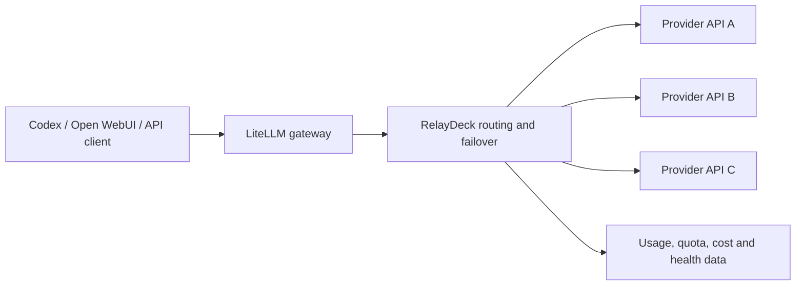

# Cost-Aware LLM Multi-Provider Router

A local LLM gateway and control plane for managing multiple provider APIs and
accounts. It routes requests by model availability, health, quota, priority,
latency, and cost, then automatically fails over to another upstream when a
model or account becomes unavailable. Codex, Open WebUI, and other clients can
keep one stable API endpoint without manual configuration changes.

## What it provides

- **Multi-provider management**: keep API accounts, credentials, quotas, and
  upstream model names organized by supplier.
- **Public model routing**: expose one stable model name while maintaining
  multiple upstream bindings behind it.
- **Automatic failover**: retry and switch to an enabled backup binding when
  the current upstream fails, is unavailable, or is disabled.
- **Cost and usage tracking**: record usage and configured pricing so provider
  cost and cost-performance can be compared using real request data.
- **Model organization**: group public models into model families and map
  provider-specific names to a consistent public model.
- **Health checks**: separate low-cost network checks from real conversation
  tests, with per-provider and per-binding status.
- **Quota adapters**: extend balance and quota collection for providers that
  do not expose a standard billing API.



## Components

- LiteLLM gateway: `http://127.0.0.1:4100`
- Claude Code gateway: `http://127.0.0.1:4101`
- Open WebUI frontend: `http://127.0.0.1:8090`
- RelayDeck management panel: `http://127.0.0.1:8091`

## Typical client configuration

Clients point to the local gateway rather than to an individual upstream:

```text
Base URL: http://127.0.0.1:4100/v1
API key:  LITELLM_MASTER_KEY
Model:    a public model name configured in the management panel
```

For example, Codex can continue using one public model such as `gpt-5.4`.
RelayDeck decides which enabled provider binding handles the request. When the
first binding fails, the fallback order is applied without changing the Codex
configuration.

### Claude Desktop model discovery

The management panel can enable `Claude Desktop 自动发现` under the model
routing tools. When enabled, RelayDeck adds Anthropic-compatible discovery
metadata to every model published to the gateway. This does not rename models
or change the OpenAI-compatible `/v1/chat/completions` route used by Codex.

Claude Desktop continues to use the same gateway through the Anthropic
`/v1/messages` endpoint. Models that do not support the required streaming or
tool-calling behavior may still fail at inference time, so enable this option
only after validating those capabilities for the selected upstreams.

### Dedicated Claude Code Gateway

RelayDeck also runs a dedicated gateway on `http://127.0.0.1:4101`. It exposes
only `claude-relaydeck-*` aliases, one for every public model on the native
gateway. Native and Claude aliases share upstream bindings, priority, and
failover chains, so Codex remains on port `4100` without seeing Claude aliases.

Open `客户端接入配置` in the management panel and choose `配置 Claude Code 自动发现`.
RelayDeck backs up and merges `%USERPROFILE%\.claude\settings.json`, points
Claude Code at port `4101`, and enables model discovery. Restart Claude Code,
then use `/model` to select aliases for the main session or subagents.

## Requirements

- Windows PowerShell
- Conda
- A Conda environment named `llm-stack-local`, or an update to
  `scripts/common.ps1` with the local environment path
- Python packages used by `admin-panel/app.py`
- LiteLLM and Open WebUI installed in the configured Conda environment

The startup scripts currently expect the environment at:
`D:/conda/envs/llm-stack-local`.

## First-time setup

1. Create or activate the Conda environment:

   ```powershell
   conda create -n llm-stack-local python=3.11
   conda activate llm-stack-local
   pip install -r requirements.txt
   ```

   The pinned file includes the current management panel, LiteLLM, and
   Open WebUI dependencies. Review and update the pins when upgrading the
   Conda environment.

2. Create the local environment file:

   ```powershell
   Copy-Item .env.example .env
   ```

3. Replace the placeholder values in `.env`. Never commit `.env` or provider
   API keys. The repository intentionally ignores `.env`, generated state,
   databases, logs, and service runtime files.

4. Optional: copy the configuration templates if you need a clean starting
   point:

   ```powershell
   Copy-Item config/litellm.yaml.example config/litellm.yaml
   Copy-Item config/relaydeck-state.example.json config/relaydeck-state.json
   ```

   In normal use, the management panel generates these runtime files after
   providers and model routes are configured.

## Start and stop

Start all services:

```powershell
powershell -NoProfile -ExecutionPolicy Bypass -File .\scripts\start-all.ps1
```

Start services individually:

```powershell
powershell -NoProfile -ExecutionPolicy Bypass -File .\scripts\start-litellm.ps1
powershell -NoProfile -ExecutionPolicy Bypass -File .\scripts\start-open-webui.ps1
powershell -NoProfile -ExecutionPolicy Bypass -File .\scripts\start-admin-panel.ps1
```

Stop all services:

```powershell
powershell -NoProfile -ExecutionPolicy Bypass -File .\scripts\stop-llm-stack.ps1
```

Open the management panel at `http://127.0.0.1:8091`. Configure a supplier,
API profile, public model, upstream binding, priority, and fallback order there.
Use network tests for low-cost connectivity checks and conversation tests only
when a real request is needed.

For reliable automatic switching, make sure each public model has at least two
enabled upstream bindings, with distinct priorities and valid provider model
names. Cost-aware routing depends on configured pricing and recorded usage;
missing pricing data is shown as unavailable rather than guessed.

## Provider adapters

Provider-specific quota scripts live in `quota-adapters/`. Start with
`quota-adapters/adapter_template.py` and follow
`docs/provider-quota-adapter-guide.md` when adding a new provider. Adapter
scripts must never contain credentials; read them from environment variables
or the managed profile passed by the application.

## Isolated browser SSO

Suppliers that use Google SSO instead of a site password can establish an
isolated RelayDeck browser session. The first built-in browser adapter targets
`lingsuan.top`:

1. Install the browser runtime once:

   ```powershell
   powershell -NoProfile -ExecutionPolicy Bypass -File .\scripts\install-browser-runtime.ps1
   ```

2. Open the supplier view, enable shared quota, and select `灵算网站后台`.
3. Click `建立浏览器登录` and complete Google sign-in in the separate Chromium
   window. RelayDeck does not read or store the Google password.
4. RelayDeck captures only the LingSuan authorization result and encrypts the
   supplier Token/Cookie with Windows DPAPI CurrentUser.

The dedicated browser profile is stored under `data/browser-sessions/` and is
excluded from Git. Chromium protects its own browser cookies for the current
Windows account; RelayDeck does not open the user's normal Edge or Chrome
profile. A browser process is used only during authorization or renewal and
may consume several hundred MB of memory while running.

When a LingSuan quota request returns an authentication failure, RelayDeck
attempts one silent renewal and retries the quota request once. Google account
selection, CAPTCHA, two-factor authentication, or revoked sessions cannot be
bypassed: the supplier card changes to `需要重新授权` and the user must complete
the visible login flow again.

## Repository safety

The following are local runtime artifacts and must stay outside Git:

- `.env` and all environment backups
- `config/litellm.yaml` and `config/relaydeck-state.json`
- `data/`, `logs/`, `run/`, `tmp/`, and virtual environments
- SQLite databases, PID files, generated reports, and archive files

Before pushing a branch, inspect the staged file list and run a secret scanner:

```powershell
git status --short
git diff --cached --name-only
gitleaks detect --no-banner --redact
```

If a credential has ever been committed or shared, revoke it at the provider
and create a replacement before making the repository public.

## License

Add a license before publishing if you want others to reuse the project. MIT is
appropriate for a permissive open-source release; otherwise keep the repository
private until the ownership and reuse terms are clear.
